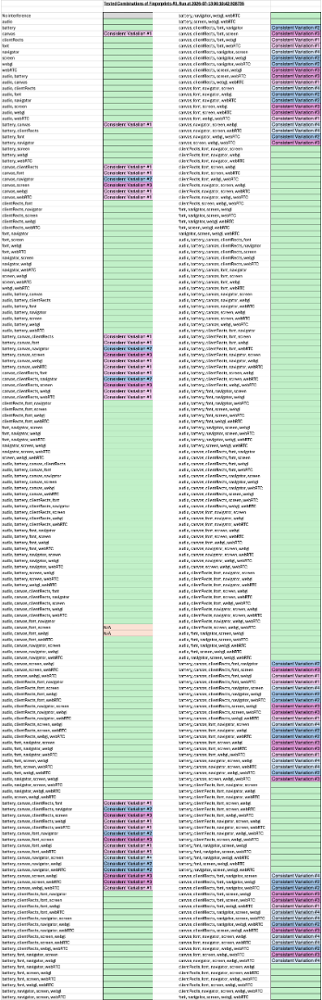
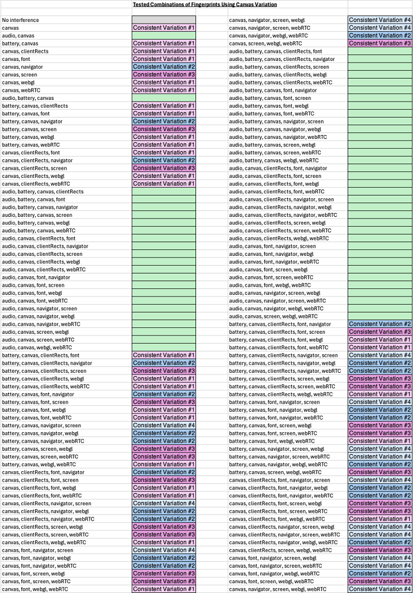

# BrowserFingerprintUtilisation

<p align="center">
  
</p>

## Notes
We are using Selenium for our Chrome driver, where for
selenium version > 4.12.0 we do not need to download the
Chrome driver manually.
Selenium's in-built tool _Selenium Manager_ automatically
downloads and manages the drivers.

See: 
+ https://www.selenium.dev/documentation/selenium_manager/ 
+ https://www.selenium.dev/blog/2023/status_of_selenium_manager_in_october_2023/

## Use
For testing against a local-machine-hosted browser fingerprinting website, in the WebsiteSetUp folder run:
```
docker build -t basic-website:latest .
docker run -d -p 8080:80 basic-website:latest
```

Install the ShiftingBrowserFingerprints package.
```
pip install git+http://github.com/PeterAFockema/ShiftingBrowserFingerprints.git
```

(Values can be reset in the test.env file)

To test the code by running all the tests, once the environment has been set up, in the current directory run:
```
behave
```
## Statement of Need
Whilst some individual fingerprinting techniques can provide more unique 
identifiers than others ( e.g. canvas fingerprinting is touted as having, 
depending on the source, between 80% and 99% accuracy [^1]), if they are 
combined with other fingerprinting techniques then there can be a 99.99+% 
accuracy. [^2] 
The result is that when fingerprinting uses a collection of techniques it can 
become highly accurate (where only 1 in 286777 browsers share the same fingerprint 
with other users on the internet [^3]).

Browser fingerprinting usage has increased at a significant rate in the last 
decade, where fingerprinting occurred on less than 1% of the 10000 most visited 
websites in 2013, yet by 2021 a quarter were employing browser fingerprinting 
techniques. [^4]

The `FingerprintObfuscation` package we are testing with this repository was designed
for stress-testing fingerprinting software against chosen obfuscation techniques and 
was developed as a fingerprinting-interference Python package that can call these 
techniques to interfere with active browser fingerprinting against a user that is 
implementing browser scraping via a set Python script.

## The Logic Behind the Software
The ShiftingBrowserFingerprints package can be used to employ any combination of a number of browser fingerprint obfuscation techniques from the following list:
* Audio
* Battery
* Canvas
* ClientRects
* Font
* Screen
* Navigator
* WebGL
* WebRTC

By overlaying these browser fingerprint obfuscation techniques, we can increase the potential 
resilience to browser fingerprinting that is now employed in many of the most trafficked websites on
the internet.

This software uses behave [^5], a behaviour-driven development framework to test combinations of these
browser fingerprinting obfuscation techniques by implementing the ShiftingBrowserFingerprints Python
package and performing browser scraping against the local-machine hosted browser fingerprinting website
that is employing FingerprintJS [^6][^7] to calculate the user's fingerprint, we then scrape the browser
fingerprint that is calculated for comparison to see how the fingerprint obfuscation techbniques have 
affected the calculated browser fingerprint of the user.

To test the code by running all varieties of these combinations of browser fingerprint obfuscation techniques, in the current directory run:
```
behave -i "testing_all_firefox_fingerprint_protection_effects.feature" --no-capture
```
## Results Observed
The following key demonstrates the variation we observe when running our fingerprint obfuscation results.
<p align="center">
  
</p>

The overall results, over the course of three runs, can be observed below.

  
  
  

A noticeable pattern was observed over the use of the canvas fingerprinting obfuscation techniques when
used in tandem with the other obfuscation techniques. 

<p align="center">
  
</p>

## Developer Notes
Due to the Chrome team removing
```
--load-extension
```
switch on Chrome builds [^8], we pivoted to focusing on using other drivers until further notice.

## References
[^1]: Ganz, T. (2024). *The Cout*, [Source Link](https://thecout.com/blog/canvas/)   
[^2]: Omisola, I. (2025). *ZenRows*, [Source Link](https://www.zenrows.com/blog/canvas-fingerprinting#what-is)   
[^3]: Eckersley, P. (2010). *Electronic Frontier Foundation*, [Source Link](https://coveryourtracks.eff.org/static/browser-uniqueness.pdf)   
[^4]: IBM. (2023). *IBM Research*, [Source Link](https://research.ibm.com/blog/browser-fingerprinting)  
[^5]: Behave. (2026). *behave 1.4.0.dev0 documentation*, [Source Link](https://behave.readthedocs.io/en/latest/)   
[^6]: Fingerprint. (2026). *Identify Every Visitor*, [Source Link](https://fingerprint.com/try/identify-now)   
[^7]: FingerprintJS. (2026). *fingerprintjs*, [Source Link](https://github.com/fingerprintjs/fingerprintjs)   
[^8]: vinaghost. (2025) *SeleniumHQ GitHub*, [Source Link](https://github.com/SeleniumHQ/selenium/issues/15788)